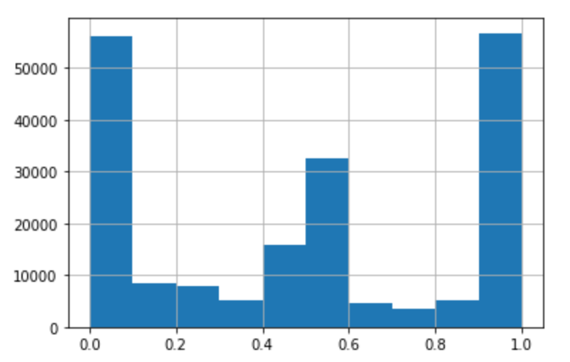
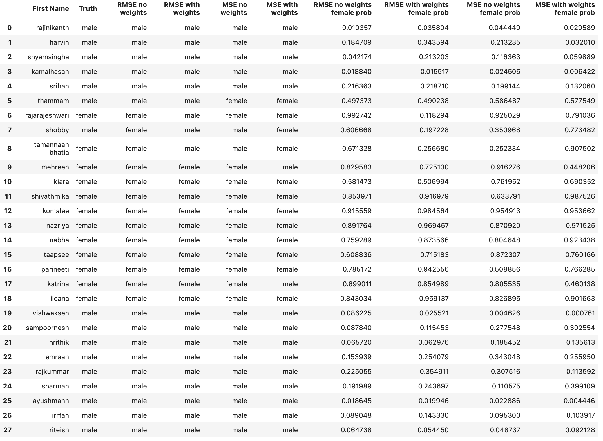

# About naampy

## Background and Motivation

The ability to programmatically and reliably infer the social attributes of a person from their name can be useful for a broad set of tasks, from estimating bias in coverage of women in the media to estimating bias in lending against certain social groups. 

Unlike the American Census Bureau, which produces lists of last names and first names that can be used to infer gender, race, ethnicity, etc., the Indian government produces no such commensurate datasets. Hence inferring the relationship between gender, ethnicity, language group, and names has generally been done with small datasets constructed in an ad-hoc manner.

naampy fills this gap by using data from the [Indian Electoral Rolls](https://github.com/in-rolls/electoral_rolls) (parsed data available [here](https://dataverse.harvard.edu/dataset.xhtml?persistentId=doi:10.7910/DVN/MUEGDT)) to estimate the proportion female, male, and third gender for a particular first name, year, and state.

## Data Sources

### Electoral Roll Data

The package capitalizes on information from parsed electoral rolls from **31 states and union territories** of India:

- **North India**: Delhi, Haryana, Himachal Pradesh, Jammu & Kashmir, Punjab, Uttarakhand
- **South India**: Andhra Pradesh, Karnataka, Kerala, Tamil Nadu
- **East India**: Bihar, Jharkhand, Odisha, West Bengal
- **West India**: Goa, Gujarat, Maharashtra, Rajasthan
- **Central India**: Chhattisgarh, Madhya Pradesh, Uttar Pradesh
- **Northeast India**: Arunachal Pradesh, Assam, Manipur, Meghalaya, Mizoram, Nagaland, Sikkim, Tripura
- **Union Territories**: Andaman & Nicobar, Chandigarh, Dadra & Nagar Haveli, Daman & Diu, Lakshadweep, Puducherry

### Data Processing Methodology

1. **Name Parsing**: Names are split into first and last names
2. **Aggregation**: Data is aggregated per state and first name
3. **Statistics Calculated**:
   - `prop_male`: Proportion of males with the name
   - `prop_female`: Proportion of females with the name  
   - `prop_third_gender`: Proportion of third gender individuals
   - `n_female`: Count of females
   - `n_male`: Count of males
   - `n_third_gender`: Count of third gender individuals
4. **Temporal Analysis**: Birth years are calculated based on age (data collected in 2017)
5. **Transliteration**: Native language rolls are transliterated to English using [indicate](https://github.com/in-rolls/indicate)

## Machine Learning Model

When a name doesn't exist in the electoral roll database, naampy uses a machine learning model that learns the relationship between character sequences in first names and gender.

### Model Architecture

- **Type**: Character-level neural network
- **Problem Formulation**: Regression (predicts female proportion)
- **Training Data**: Indian electoral roll names
- **Classification**: Names with predicted proportion < 0.5 are classified as male, otherwise female

### Model Performance

On test data:
- **MSE (Mean Squared Error)**: 0.05
- **RMSE (Root Mean Squared Error)**: 0.22

The model handles the fact that some names are shared between men and women, as shown in the distribution of female proportions:



### Inference Results

The model shows strong performance across different name types:



## Important Considerations

### Data Limitations

1. **Registration Bias**: Voting registration lists may underrepresent certain groups (poor people, minorities)
2. **Adult Census**: Electoral rolls only include adult citizens, potentially missing gender biases that prevent individuals from reaching adulthood
3. **Name Parsing**: Indian names are complex with various formats and conventions
4. **Transliteration Quality**: For non-English/Hindi electoral rolls, transliteration quality may vary

### Ethical Considerations

1. **Privacy**: All data is aggregated; no individual-level information is exposed
2. **Use Cases**: Should be used thoughtfully and ethically
3. **Accuracy**: No name-based method is 100% accurate
4. **Cultural Sensitivity**: Respect the diversity of Indian naming conventions

## Related Projects

naampy is part of a larger ecosystem of tools for demographic inference:

- [**pranaam**](https://github.com/appeler/pranaam): Predict religion based on names using Bihar land records
- [**outkast**](https://github.com/appeler/outkast): Map last names to caste categories using SECC 2011 data
- [**parsernaam**](https://github.com/appeler/parsernaam): AI-powered name parsing
- [**indicate**](https://github.com/in-rolls/indicate): Hindi to English transliteration

## Citation

If you use naampy in your research, please cite:

```bibtex
@software{naampy,
  author = {Laohaprapanon, Suriyan and Sood, Gaurav and Chintalapati, Rajashekar},
  title = {naampy: Infer Sociodemographic Characteristics from Indian Names},
  url = {https://github.com/appeler/naampy},
  year = {2023}
}
```

## License

naampy is released under the MIT License. See the LICENSE file for details.

## Contributing

Contributions are welcome! Please feel free to submit a Pull Request. For major changes, please open an issue first to discuss what you would like to change.

## Support

- **Issues**: [GitHub Issues](https://github.com/appeler/naampy/issues)
- **Documentation**: [This documentation](https://appeler.github.io/naampy/)
- **Interactive Demo**: [Streamlit App](https://naampy.streamlit.app/)

## Authors

- Suriyan Laohaprapanon
- Gaurav Sood
- Rajashekar Chintalapati