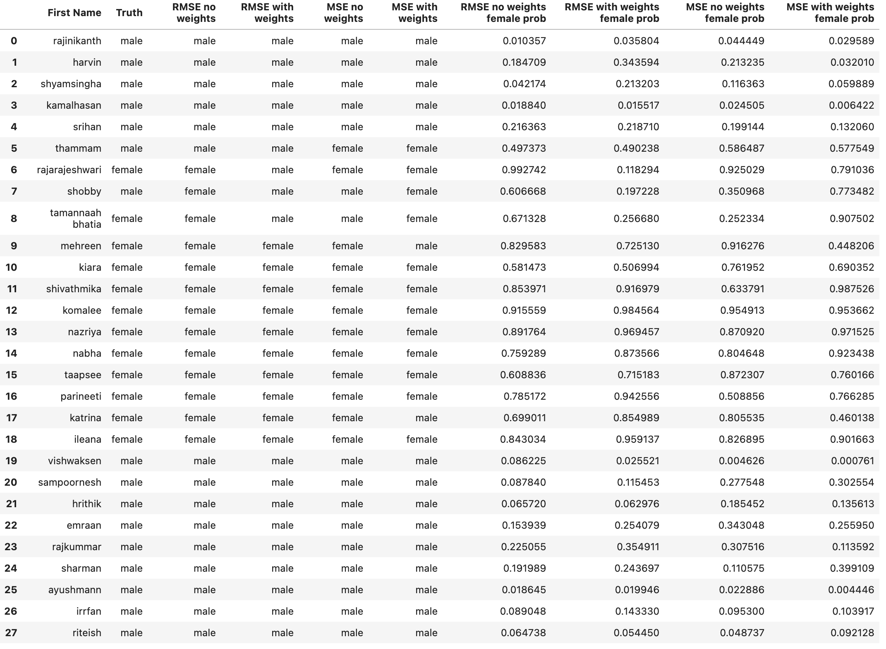

naampy: Infer Sociodemographic Characteristics from Indian Names
----------------------------------------------------------------

.. image:: https://travis-ci.org/appeler/naampy.svg?branch=master
    :target: https://travis-ci.org/appeler/naampy
.. image:: https://ci.appveyor.com/api/projects/status/q4wr4clilf4samlk?svg=true
    :target: https://ci.appveyor.com/project/soodoku/naampy
.. image:: https://img.shields.io/pypi/v/naampy.svg
    :target: https://pypi.python.org/pypi/naampy
.. image:: https://pepy.tech/badge/naampy
    :target: https://pepy.tech/project/naampy

The ability to programmatically reliably infer social attributes of a person from their name can be useful for a broad set of tasks, from estimating bias in coverage of women in the media to estimating bias in lending against certain social groups. But unlike the American Census Bureau, which produces a list of last names and first names, which can (and are) used to infer the gender, race, ethnicity, etc. from names, the Indian government produces no such commensurate datasets. And hence inferring the relationship between gender, ethnicity, language group, etc. and names has generally been done with small datasets constructed in an ad-hoc manner.

We fill this yawning gap. Using data from the `Indian Electoral Rolls <https://github.com/in-rolls/electoral_rolls>`__ (parsed data `here <https://dataverse.harvard.edu/dataset.xhtml?persistentId=doi:10.7910/DVN/MUEGDT>`__), we estimate the proportion female, male, and `third sex` (see `here <https://en.wikipedia.org/wiki/Third_gender>`__) for a particular `first name, year, and state.`

Data
~~~~

In all, we capitalize on information in the parsed electoral rolls from the following 31 states and union territories: 

.. list-table:: States
   :widths: 30 30 30 30
    
   * - Andaman
     - Delhi
     - Kerala
     - Puducherry
   
   *  - Andhra Pradesh
      - Goa
      - Madhya Pradesh
      - Punjab
   *  - Arunachal Pradesh
      - Gujarat
      - Maharashtra
      - Rajasthan 
   *  - Assam
      - Haryana
      - Manipur
      - Sikkim
   *  - Bihar
      - Himachal Pradesh
      - Meghalaya
      - Tripura 
   *  - Chandigarh
      - Jammu and Kashmir
      - Mizoram
      - Uttar Pradesh   
   *   - Dadra
       - Jharkhand
       - Nagaland
       - Uttarakhand
   *  -  Daman
      - Karnataka
      - Odisha
      - 
  

How is the underlying data produced?
====================================

We split the name into first name and last name (see the python notebook for how we do this) and then aggregate per state and first_name, and tabulate `prop_male, prop_female, prop_third_gender, n_female, n_male, n_third_gender`

This is used to provide the base prediction.

Given the association between prop_female and first_name may change over time, we exploited the age. Given the data were collected in 2017, we calculate the year each person was born and then do a group by year to create `prop_male, prop_female, prop_third_gender, n_female, n_male, n_third_gender`

Issues with underlying data
==============================

Concerns:

* Voting registration lists may not be accurate, systematically underrepresenting poor people, minorities, and similar such groups.

* Voting registration lists are at best a census of adult citizens. But to the extent there is prejudice against women, etc., that prevents them from reaching adulthood, the data bakes those biases in.

* Indian names are complicated. We do not have good parsers for them yet. We have gone for the default arrangement. Please go through the notebook to look at the judgments we make. We plan to improve the underlying data over time.

* For states with non-English rolls, we use libindic to transliterate the names. The transliterations are consistently bad. (We hope to make progress here. We also plan to provide a way to match in the original script.)

Gender Classifier
~~~~~~~~~~~~~~~~~

We start by providing a base model for first\_name that gives the Bayes
optimal solution providing the proportion of people with that name who
are women. We also provide a series of base models where the state of
residence and year of birth is known.

If name does not exist in database, we use `ML model <https://github.com/appeler/naampy/blob/master/naampy/data/ml_model/02_training_model.ipynb>`__ that use the relationship between
sequences of characters in the first name and gender to predict gender from a name.

Model was trained as regression problem instead of plain classification,
because we need to consider proportion of people with that name. Model predicts 
the female proportion of the name, if it is less than 0.5 then it is a male name, if not then it is female name.

.. math::
    \text{Female proportion} = \frac{\text{Number of female}}{\text{Number of female + Number of male}}

Refer below histogram for the female proportion for the dataset which model is trained on. 

.. figure:: images/female_prop.png
   :width: 400px
   :height: 250px
   :alt: Female proportion
   :align: center

   Female proportion

**Below are the results on model loss function and metrics on test dataset**

MSE no weights - loss: 0.04974181950092316, metric: 0.04974181950092316

RMSE no weights - loss: 0.21903139352798462, metric: 0.2212539166212082

**Below are the results on model loss function and metrics on test dataset with weights**

RMSE with weights - loss: 0.21645867824554443, metric: 0.2223343402147293

MSE with weights - loss: 0.0501617006957531, metric: 0.043311625719070435

Where weight is calculated like below - 

.. math::
    \text{weight}_i = \frac{\text{no of females}_i + \text{no of males}_i}{\text{Total population}}

    \text { Weighted MSE } = \frac{\sum_{i=1}^{n} \text { weights }_{i}\left(\text { predicted }_{\mathrm{i}}-\text { actual }_{i}\right)^{2}}{\sum_{1=1}^{n} \text { weights }_{\mathrm{i}}}

    \text { Weighted RMSE } = \sqrt{\frac{\sum_{i=1}^{n} \text { weights }_{i}\left(\text { predicted }_{\mathrm{i}}-\text { actual }_{i}\right)^{2}}{\sum_{1=1}^{n} \text { weights }_{\mathrm{i}}}}

Below are the inference results using different models.

   Inference results using different models

Installation
~~~~~~~~~~~~~~

We strongly recommend installing `naampy` inside a Python virtual environment (see `venv documentation <https://docs.python.org/3/library/venv.html#creating-virtual-environments>`__)

::

    pip install naampy

Usage
~~~~~

::

    usage: in_rolls_fn_gender [-h] -f FIRST_NAME
                            [-s {andaman,andhra,arunachal,assam,bihar,chandigarh,dadra,daman,delhi,goa,gujarat,haryana,himachal,jharkhand,jk,karnataka,kerala,maharashtra,manipur,meghalaya,mizoram,mp,nagaland,odisha,puducherry,punjab,rajasthan,sikkim,tripura,up,uttarakhand}]
                            [-y YEAR] [-o OUTPUT]
                            input
  
    Appends Electoral roll columns for prop_female, n_female, n_male
    n_third_gender by first name

    positional arguments:
    input                 Input file

    optional arguments:
    -h, --help            show this help message and exit
    -f FIRST_NAME, --first-name FIRST_NAME
                            Name or index location of column contains the first
                            name
    -s {andaman,andhra,arunachal,assam,bihar,chandigarh,dadra,daman,delhi,goa,gujarat,haryana,himachal,jharkhand,jk,karnataka,kerala,maharashtra,manipur,meghalaya,mizoram,mp,nagaland,odisha,puducherry,punjab,rajasthan,sikkim,tripura,up,uttarakhand},
    --state {andaman,andhra,arunachal,assam,bihar,chandigarh,dadra,daman,delhi,goa,gujarat,haryana,himachal,jharkhand,jk,karnataka,kerala,maharashtra,manipur,meghalaya,mizoram,mp,nagaland,odisha,puducherry,punjab,rajasthan,sikkim,tripura,up,uttarakhand}
                            State name of Indian electoral rolls data
                            (default=all)
    -y YEAR, --year YEAR  Birth year in Indian electoral rolls data
                            (default=all)
    -o OUTPUT, --output OUTPUT
                            Output file with Indian electoral rolls data columns

Using naampy
~~~~~~~~~~~~

::

    >>> import pandas as pd
    >>> from naampy import in_rolls_fn_gender

    >>> names = [{'name': 'gaurav'},
                 {'name': 'nabha'},
                 {'name': 'yasmin'},
                 {'name': 'deepti'},
                 {'name': 'hrithik'},
                 {'name': 'vivek'}]

    >>> df = pd.DataFrame(names)

    >>> in_rolls_fn_gender(df, 'name')
                name    n_male  n_female  n_third_gender  prop_female  prop_male  prop_third_gender pred_gender  pred_prob
        0   gaurav   25625.0      47.0             0.0     0.001831   0.998169                0.0         NaN        NaN
        1    nabha       NaN       NaN             NaN          NaN        NaN                NaN      female   0.755028
        2   yasmin      58.0    6079.0             0.0     0.990549   0.009451                0.0         NaN        NaN
        3   deepti      35.0    5784.0             0.0     0.993985   0.006015                0.0         NaN        NaN
        4  hrithik       NaN       NaN             NaN          NaN        NaN                NaN        male   0.922181
        5    vivek  233622.0    1655.0             0.0     0.007034   0.992966                0.0         NaN        NaN
    
    >>> help(in_rolls_fn_gender)
    Help on method in_rolls_fn_gender in module naampy.in_rolls_fn:

    in_rolls_fn_gender(df, namecol, state=None, year=None) method of builtins.type instance
        Appends additional columns from Female ratio data to the input DataFrame
        based on the first name.

        Removes extra space. Checks if the name is the Indian electoral rolls data.
        If it is, outputs data from that row.

        Args:
            df (:obj:`DataFrame`): Pandas DataFrame containing the first name
                column.
            namecol (str or int): Column's name or location of the name in
                DataFrame.
            state (str): The state name of Indian electoral rolls data to be used.
                (default is None for all states)
            year (int): The year of Indian electoral rolls to be used.
                (default is None for all years)

        Returns:
            DataFrame: Pandas DataFrame with additional columns:-
                'n_female', 'n_male', 'n_third_gender',
                'prop_female', 'prop_male', 'prop_third_gender' by first name

    # If you want to use model prediction use `predict_fn_gender` like below
    from naampy import predict_fn_gender
    input = [
         "rajinikanth",
         "harvin",
         "Shyamsingha",
         "srihan",
         "thammam",
         "bahubali",
         "rajarajeshwari",
         "shobby",
         "tamannaah bhatia",
         "mehreen",
         "kiara",
         "shivathmika",
         "komalee",
         "nazriya",
         "nabha",
         "taapsee",
         "parineeti",
         "katrina",
         "ileana",
         "vishwaksen",
         "sampoornesh",
         "hrithik",
         "emraan",
         "rajkummar",
         "sharman",
         "ayushmann",
         "irrfan",
         "riteish"
    ]
    print(predict_fn_gender(input))

                        name pred_gender  pred_prob
    0        rajinikanth        male   0.994747
    1             harvin        male   0.840713
    2        shyamsingha        male   0.956903
    3             srihan        male   0.825542
    4            thammam      female   0.564286
    5           bahubali        male   0.901159
    6     rajarajeshwari      female   0.942478
    7             shobby        male   0.788314
    8   tamannaah bhatia      female   0.971478
    9            mehreen      female   0.659633
    10             kiara      female   0.614125
    11       shivathmika      female   0.743240
    12           komalee      female   0.901051
    13           nazriya      female   0.854167
    14             nabha      female   0.755028
    15           taapsee      female   0.665176
    16         parineeti      female   0.813237
    17           katrina      female   0.630126
    18            ileana      female   0.640331
    19        vishwaksen        male   0.992237
    20       sampoornesh        male   0.940307
    21           hrithik        male   0.922181
    22            emraan        male   0.795963
    23         rajkummar        male   0.845139
    24           sharman        male   0.858538
    25         ayushmann        male   0.964895
    26            irrfan        male   0.837053
    27           riteish        male   0.950755

Functionality
~~~~~~~~~~~~~

When you first run `in_rolls_fn_gender`, it downloads data from `Harvard Dataverse <https://dataverse.harvard.edu/dataset.xhtml?persistentId=doi:10.7910/DVN/WZGJBM>`__ to the local folder. Next time you run the function, it searches for local data and if it finds it, it uses it.
Use `predict_fn_gender` to get gender predictions based on first name.

Authors
~~~~~~~

Suriyan Laohaprapanon, Gaurav Sood and Rajashekar Chintalapati

License
~~~~~~~

The package is released under the `MIT
License <https://opensource.org/licenses/MIT>`__.
